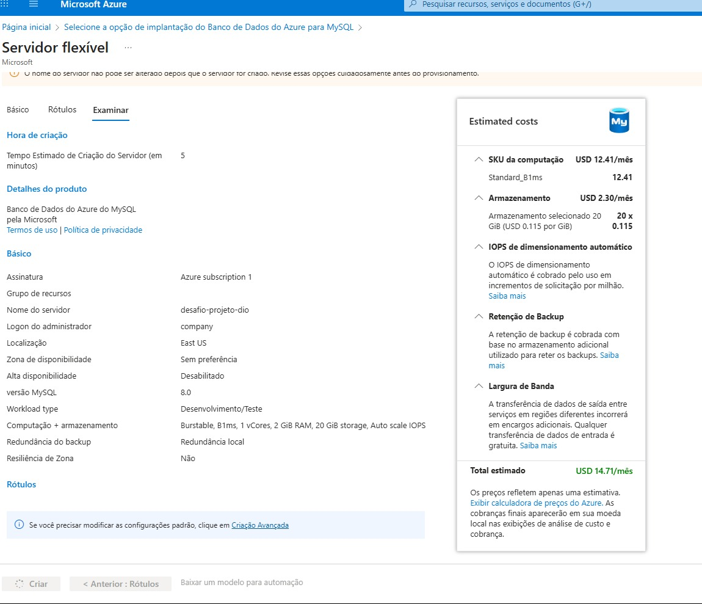
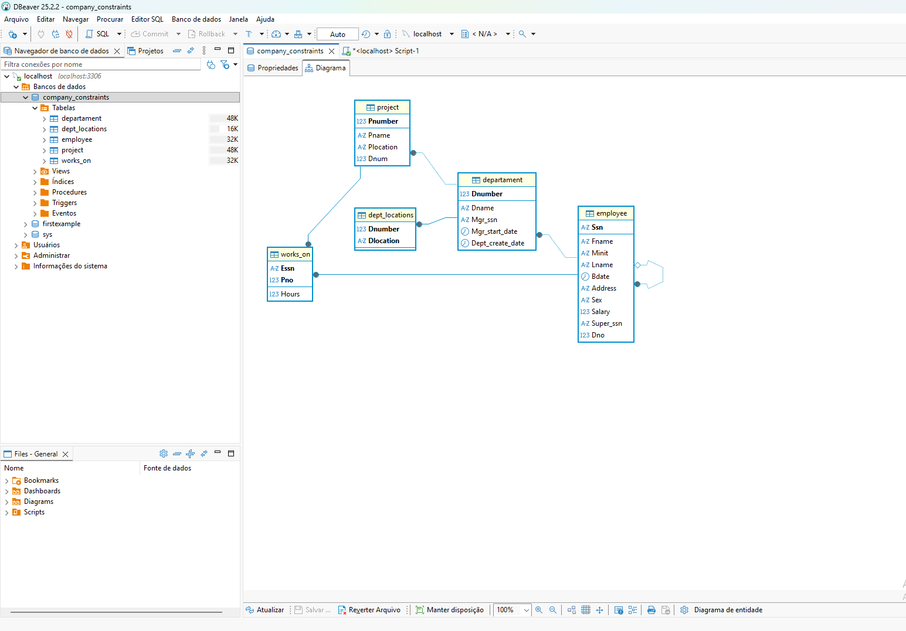
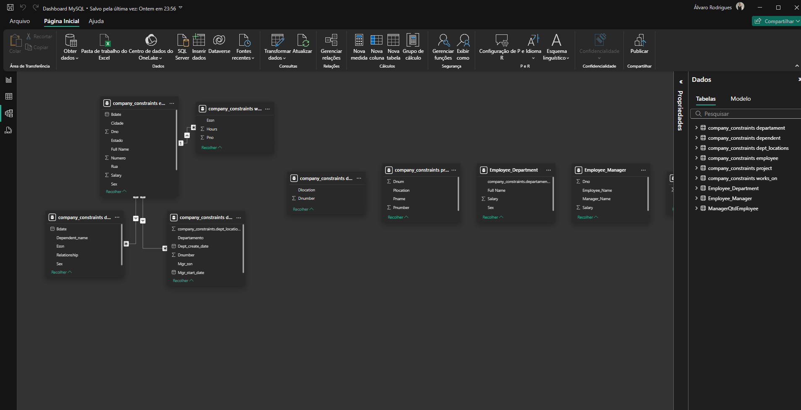
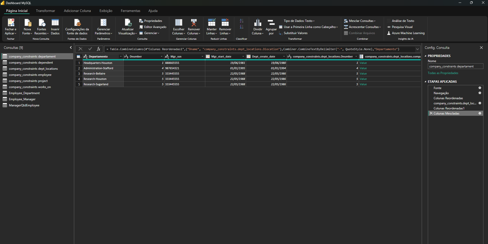

# 💼 Desafio: Modelagem e Análise de Dados com Power BI e MySQL

## 📖 Descrição Geral
Este projeto faz parte do **Bootcamp DIO - Power BI Analyst** e tem como objetivo praticar a **integração entre banco de dados MySQL** e o **Power BI**, passando pelas etapas de modelagem, consultas SQL e transformação de dados no Power Query.

A base de dados utilizada simula uma estrutura corporativa contendo colaboradores, departamentos, projetos e dependentes.  
Durante o desafio, foram realizadas etapas de criação de banco, inserção de dados, integração e limpeza no Power BI.

---

## ⚙️ Ambiente e Desafios Técnicos
O desafio original pedia a criação do banco no **Azure Database for MySQL**.  
Porém, durante a configuração, o servidor apresentava o erro:

> ❌ “Database creation failed – server not initializing”

Diante disso, optei por **executar o projeto localmente**, mantendo todas as etapas de modelagem e integração.

**Banco de dados:** `company_constraints`

**Ferramentas utilizadas:**
- 🐬 **MySQL Server 8.x**
- 🧩 **DBeaver** (para execução e gerenciamento dos scripts SQL)
- 📊 **Power BI Desktop** (para integração e transformação dos dados)
- 🔗 **Power Query** (para mescla e modelagem)
- 🧱 **GitHub** (para versionamento e documentação)

Durante a conexão com o Power BI, também foi necessário ajustar o método de autenticação do MySQL, substituindo: caching_sha2_password → mysql_native_password

---

## 🗃️ Estrutura do Banco de Dados
Banco: **`company_constraints`**

Tabelas implementadas:
- `employee`
- `departament`
- `dept_locations`
- `project`
- `works_on`
- `dependent`

Todas com suas respectivas **chaves primárias, estrangeiras e constraints**, conforme o modelo proposto no desafio.

---

## 🧠 Etapas Realizadas

### 🔹 1. Criação e Inserção
- Criação das tabelas no MySQL com integridade referencial.  
- Inserção dos registros com os scripts fornecidos no desafio.

### 🔹 2. Integração com o Power BI
- Conexão local via driver MySQL.  
- Importação das tabelas no Power BI Desktop.

### 🔹 3. Tratamento no Power Query
- **Mescla entre `employee` e `departament`** → para exibir o nome do departamento de cada colaborador.  
- **Junção entre colaboradores e respectivos gerentes** → via `Super_ssn`.  
- **Mescla entre `departament` e `dept_locations`** → criando uma chave única “Departamento + Localização”.  
- **Agrupamento de dados** → para identificar quantos colaboradores existem por gerente.  
- **Remoção de colunas desnecessárias** → mantendo apenas as relevantes para análise.

---

## 💬 Explicação Técnica – “Por que usar Mesclar e não Atribuir?”
> O **Mesclar (Merge)** é usado para **combinar registros de duas tabelas relacionadas**, mantendo a integridade entre elas.  
> Já o **Atribuir (Append)** serve para **empilhar tabelas de mesma estrutura**, unindo linhas de conjuntos de dados semelhantes.  
>
> No caso do desafio, as tabelas `departament` e `dept_locations` possuem informações **complementares e únicas**, não repetitivas.  
> Por isso, **devemos usar o Mesclar**, garantindo que cada combinação “Departamento + Localização” permaneça correta e sem duplicação.

---

## 📊 Resultados e Análises
O modelo final ficou pronto para:
- Visualizar **hierarquia de gerentes e colaboradores**  
- Relacionar **departamentos e suas localizações**  
- Preparar a base para um **modelo estrela** nos módulos seguintes do Bootcamp  

---

## 🧰 Tecnologias Utilizadas
| Ferramenta | Função |
|-------------|--------|
| **MySQL Server 8.x** | Banco de dados relacional |
| **DBeaver** | Execução e gerenciamento dos scripts SQL |
| **Power BI Desktop** | Conexão, modelagem e visualização |
| **Power Query** | Limpeza, mescla e transformação dos dados |
| **GitHub** | Versionamento e documentação do projeto |

---

## 🚀 Aprendizados
- Resolver erros de autenticação MySQL (`caching_sha2_password`)  
- Tratar e integrar dados reais entre SQL e Power BI  
- Aplicar mescla, agrupamento e criação de chaves únicas  
- Estruturar modelos relacionais com visão analítica  
- Contornar problemas de ambiente e seguir com o projeto localmente

---

## 🖼️ Imagens do Projeto

### 1️⃣ Erro no Azure
Mostra o problema enfrentado ao tentar criar o banco no Azure:

---

### 2️⃣ Banco de dados local no DBeaver
Visualização da estrutura do banco `company_constraints` e tabelas:

---

### 3️⃣ Modelo de Dados no Power BI
Mostra os relacionamentos entre as tabelas:

---

### 4️⃣ Power Query
Exemplo de tratamento e mescla das tabelas no Power BI:

---

👨‍💻 **Autor:** Álvaro Gonçalves Rodrigues  
📅 **Bootcamp:** DIO - Power BI Analyst  
📍 **Projeto:** “Integrando Dados com MySQL Azure e Transformando com Power BI”

